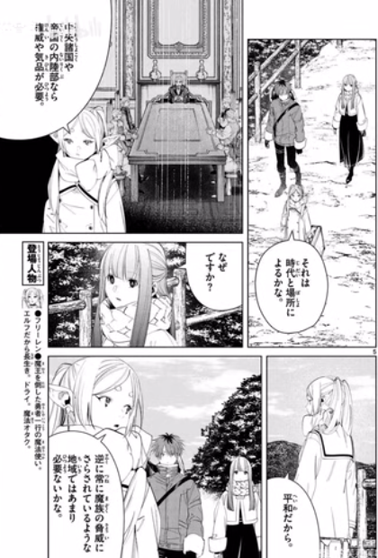
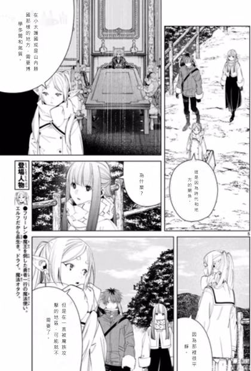

Markdown
# 📚 Comic Translator (漫畫翻譯工具)

Comic Translator 是一個基於 Python 與 CustomTkinter 開發的自動化漫畫翻譯與嵌字工具。本專案整合了物件偵測 (YOLO)、光學字元辨識 (OCR)、影像分割 (MobileSAM) 以及大型語言模型 (LLM, 透過 Groq API)，提供從原文提取、翻譯到自動排版嵌字的一站式解決方案。

## 🖼️ 效果演示 (Demo)

### 翻譯前後狀態對比 (Before vs After)

| 1. 翻譯前 (Original Japanese) | 2. 自動翻譯與嵌字後 (Translated Chinese) |
| :---: | :---: |
|  |  |
|  |  |

## ✨ 核心功能 (Features)

* **自動化翻譯管線**：
    * **文字定位**：使用 YOLO 模型精準框選對話框與文字區域。
    * **文字辨識 (OCR)**：整合 MOCR 提取日文/外文內容。
    * **智慧翻譯**：串接 Groq API (LLM)，提供具備上下文感知與口語化的翻譯結果。
* **精確影像處理與排版 (Typesetting)**：
    * **對話框分割**：利用 MobileSAM (Vision Transformer Tiny) 提取精確的對話框遮罩 (Mask)，並計算最佳「安全內接矩形」，避免文字溢出。
    * **智慧文字渲染**：支援中文字元自動換行、垂直/水平排版，並根據邊界框 (Bounding Box) 動態計算行距與字體大小。
* **現代化 GUI 介面**：
    * 基於 `customtkinter` 打造的深色模式 UI，具備側邊欄導航。
    * **翻譯介面**：支援模型動態載入、批次處理資料夾內的圖片，並具備進度回報機制 (Progress callback)。
    * **調整與檢查介面**：提供強大的畫布操作 (縮放、裁切)，並具備**屬性檢查器鎖定機制 (Inspector Lock)**，確保狀態機獨立，避免 UI 幽靈狀態與型別錯誤。

## 🏗️ 系統架構 (Architecture)

本專案採用前後端分離與模組化設計：

```text
📁 Comic-Translator
├── 📄 app.py                 # 應用程式進入點，管理 GUI 路由與佈局
├── 📁 GUI/                   # 介面層
│   ├── 📄 page_translate.py  # 翻譯執行面板 (模型載入、批次翻譯)
│   └── 📄 page_adjust.py     # 嵌字與微調面板 (支援狀態機解耦與防呆機制)
├── 📁 Backend/               # 邏輯層
│   ├── 📄 Backend.py         # 核心引擎 (TranslationEngine)，封裝 API、YOLO、MOCR 與 JSON 存檔邏輯
│   ├── 📄 image_processor.py     # 影像處理模組，封裝 MobileSAM 的遮罩預測與邊界計算
│   ├── 📄 TextRenderer.py        # 文字渲染引擎，處理 PIL 繪圖、自動換行與文字尺寸估算
└── 📄 README.md              # 專案說明文件
```

# 📚 Comic Translator (漫畫翻譯工具)

Comic Translator 是一個基於 Python 與 CustomTkinter 開發的自動化漫畫翻譯與嵌字工具。本專案整合了物件偵測 (YOLO)、光學字元辨識 (OCR)、影像分割 (MobileSAM) 以及大型語言模型 (LLM)，提供從原文提取、翻譯到自動排版嵌字的一站式解決方案。

## 🚀 快速開始 (Getting Started)

### 1. 環境依賴 (Prerequisites)
請確保您的系統已安裝 Python 3.8+，並安裝以下核心套件：

```bash
pip install customtkinter pillow opencv-python numpy python-dotenv groq torch
```

### 2. 環境變數設定
本系統依賴 Groq API 進行 LLM 翻譯。請在專案根目錄建立 .env 檔案並填入：

```bash
GROQ_API_KEY=your_api_key_here
```

### 3. 執行應用程式

```bash
python app.py
```

## 開發與技術亮點 (Technical Highlights)

作為一款為生產力設計的工具，本專案在工程實作上解決了以下挑戰：

* **狀態機徹底分離 (State Machine Decoupling)**：
在 page_adjust.py 中實作了嚴格的 Inspector Lock。當未選取文字框時，所有編輯工具（文字、大小、顏色）會強制鎖定 (Disabled) 並套用系統級安全預設值，

* **非同步與執行緒安全**：
在 page_translate.py 的批次翻譯過程中使用 threading.Thread 進行背景處理，並透過 after(0, ...) 將 UI 更新推回主執行緒，確保介面不卡頓。

* **精準的視覺運算**：
image_processor.py 結合了物件偵測 (Bounding Box) 與影像分割 (Semantic Masking)。透過 OpenCV 的 findNonZero 與 boundingRect 搭配內縮比例參數 (scale=0.7)，在不規則對話框中找出最完美的矩形排版空間。

## 貢獻與除錯 (Contributing & Debugging)
* **資料持久化**：翻譯結果與文字框座標會序列化並儲存於 data/ 目錄下的 .json 檔案中，方便後續中斷恢復或手動除錯。

* **日誌系統**：日誌 (Log) 系統已透過 Callback 注入到 GUI 控制台中，開發時可直接在 UI 上檢視 Backend 的錯誤拋出。
